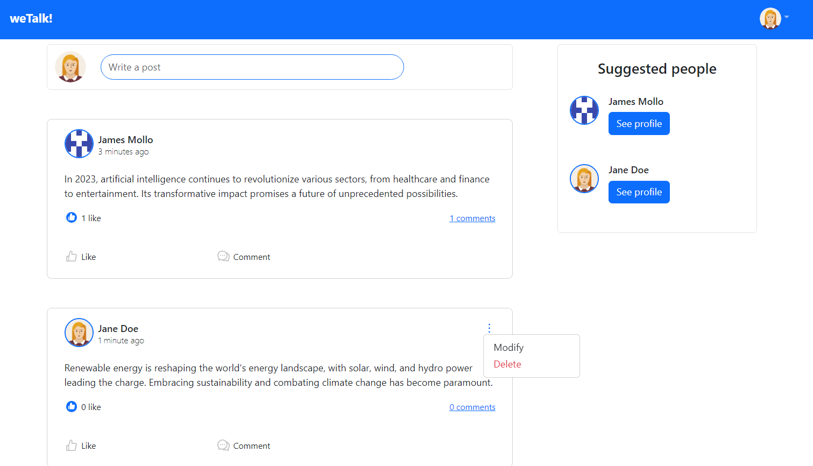
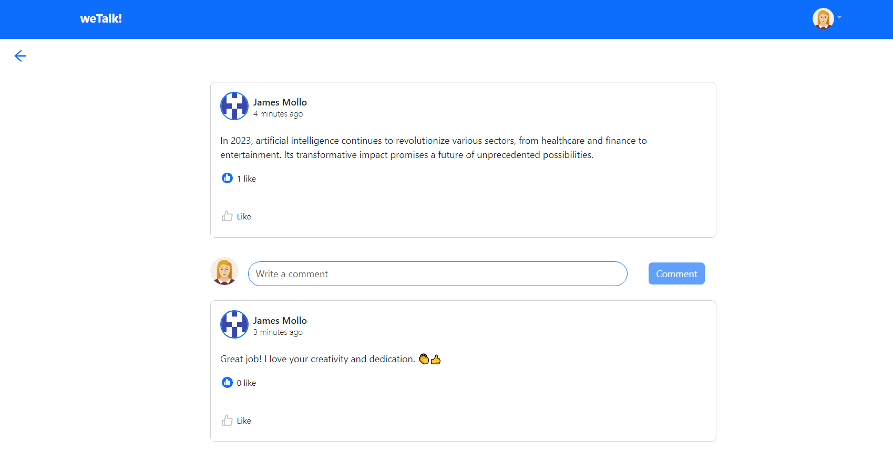
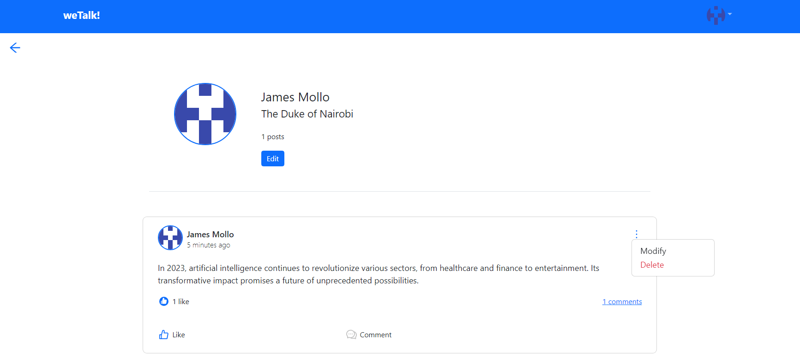

# weTalk App

Introducing weTalk - a revolutionary full-stack social media web application that will redefine the way people connect and interact online.

Built with a focus on user experience and cutting-edge technology, weTalk offers a seamless and dynamic platform for sharing ideas, and memories with friends and family. The robust backend, powered by Django and PostgreSQL, ensures secure and efficient data storage, while the RESTful APIs enable real-time updates and smooth communication between clients and servers.

With the React frontend and Context API, weTalk delivers an intuitive and interactive user interface, allowing users to customize their profiles and engage with others effortlessly. To guarantee scalability and performance, the application is containerized with Docker, and AWS cloud services provide a reliable and scalable infrastructure.

Join weTalk today to experience the future of social media - a feature-rich, secure, and innovative platform that brings people closer together.

## Views

<p align="center">
  
</p>

<p align="center">
  
</p>

<p align="center">
  
</p>

## Technologies

- Python
- Django
- Django Rest Framework,
- PostgreSQL
- Redis
- JavaScript
- HTML
- CSS
- Bootstrap
- React
- Context API
- Jest
- RTL
- pytest
- Docker
- Github Actions
- NGINX

## Environment Requirements

- Node v16
- Python v3.8
- Docker
- Redis

```
Please try running these commands:
$ sudo su postgres
$  psql
postgres=# DROP DATABASE weTalkdb;
postgres=# CREATE DATABASE weTalkdb;
postgres=# ALTER ROLE postgres SET client_encoding TO 'utf8';
postgres=# ALTER ROLE postgres SET default_transaction_isolation TO 'read committed';
postgres=# ALTER ROLE postgres SET timezone TO 'UTC';
postgres=# ALTER DATABASE weTalkdb OWNER TO postgres;
postgres=# GRANT ALL PRIVILEGES ON DATABASE weTalkdb TO postgres;
```

## Backend

### Installation

- Clone the project: `git@github.com:rOluochKe/weTalk.git`
- Change directory into: `cd /weTalk`
- Create your environment and install dependencies: `pip install -r requirements.txt`
- Configure your environment, create `.env` file from a copy of `.env.example`
- Run docker build: `docker compose up -d --build`
- Run tests: `docker-compose exec -T api pytest`

### API Endpoints

#### Auth

```
- POST /api/auth/register/
- POST /api/auth/login/
- POST /api/auth/refresh/
- POST /api/auth/logout/
```

#### User

```
- GET /api/user/
- PATCH /api/user/:user-id/
```

#### Post

```
- GET /api/post/
- GET /api/post/:post-id/
- PATCH /api/post/:post-id/
- DELETE /api/post/:post-id/
```

#### Like

```
- POST /api/post/:post-id/like/
- DELETE /api/post/:post-id/remove_like/
```

#### Comment

```
- POST /api/post/:post-id/comment/
- GET /api/post/:post-id/comment/
- PATCH /api/post/:post-id/comment/
- DELETE /api/post/:post-id/comment/
```

## Frontend

### Installation

- Change directory into: `cd /frontend-app`
- Install dependencies: `yarn install`
- Configure your environment, create `.env` file from a copy of `.env.example`
- Run app: `yarn start`
- Run tests: `yarn test`
